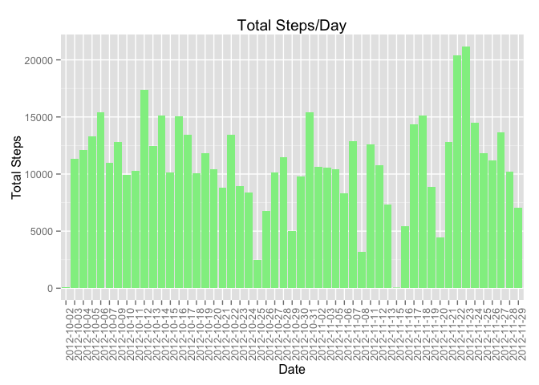
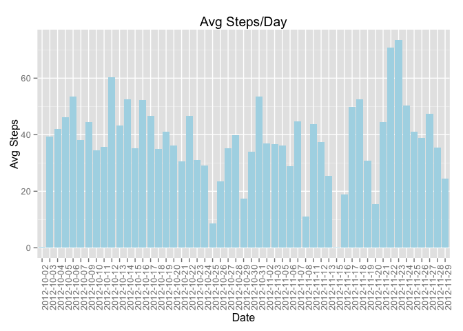
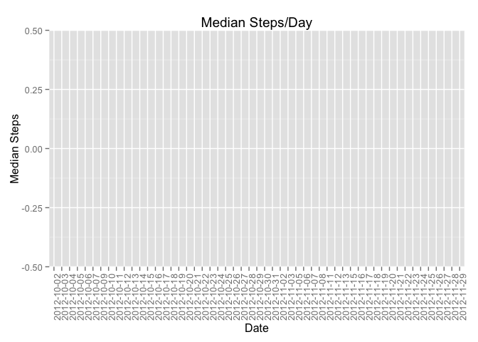
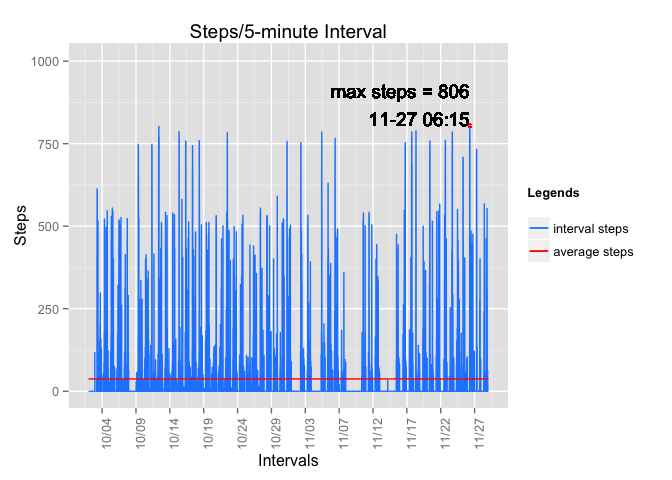
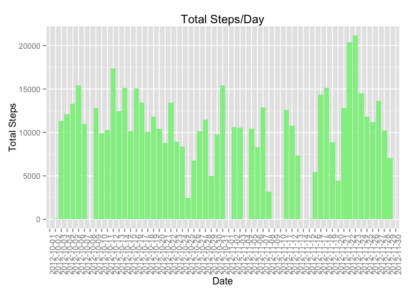
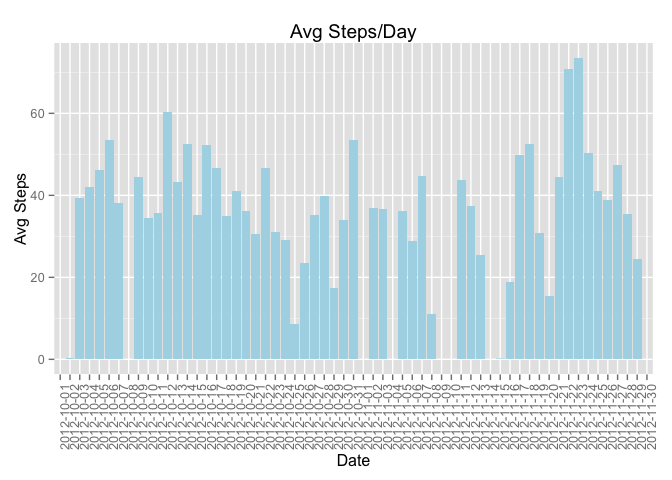
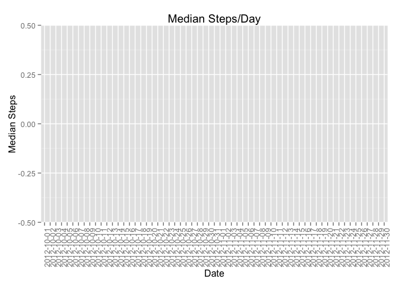
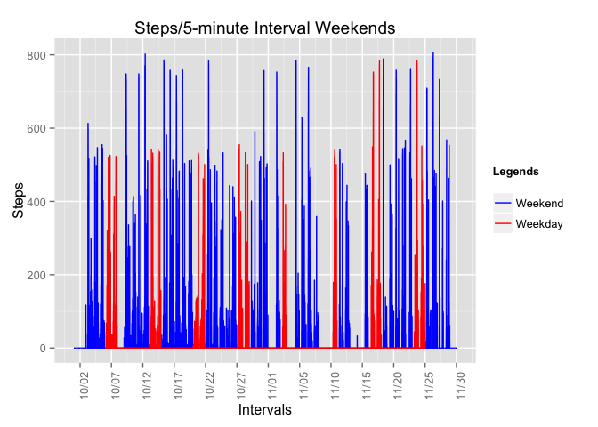

# Reproducible Research: Peer Assessment 1


## Loading and preprocessing the data
Download, unzip and read the file. To save some time, I first check whether the file exists and whether the object has been defined (i.e. file read).

Once the file is read. NAs are removed and data are aggregated in order to answer the following questions.


```r
if (!file.exists("activity.zip")) {
    downloaded_file <- download.file("https://d396qusza40orc.cloudfront.net/repdata%2Fdata%2Factivity.zip", destfile="activity.zip", method="curl")
} else if (!exists("activity")) {
    activity_file <- unzip("activity.zip")
    activity <- read.csv(activity_file)
}
# removing NAs
daily_steps <- activity[!is.na(activity$steps),]
library(dplyr)
```

```
## 
## Attaching package: 'dplyr'
## 
## The following object is masked from 'package:stats':
## 
##     filter
## 
## The following objects are masked from 'package:base':
## 
##     intersect, setdiff, setequal, union
```

```r
# prepare data to answer the questions
daily_activity_sum <- daily_steps %>% group_by(date) %>% summarise_each(funs(sum), steps) %>% rename(total_steps = steps)
daily_activity_mean <- daily_steps %>% group_by(date) %>% summarise_each(funs(mean), steps) %>% rename(avg_steps = steps)
daily_activity_median <- daily_steps %>% group_by(date) %>% summarise_each(funs(median), steps) %>% rename(median_steps = steps)
```

## What is mean total number of steps taken per day?
The following plots shows total steps, mean and median per day respectively.

 

Average Steps Per Day

<!-- html table generated in R 3.1.2 by xtable 1.7-4 package -->
<!-- Sun Apr 19 16:36:36 2015 -->
<table border=1>
<tr> <th>  </th> <th> date </th> <th> avg_steps </th>  </tr>
  <tr> <td align="right"> 1 </td> <td> 2012-10-02 </td> <td align="right"> 0.44 </td> </tr>
  <tr> <td align="right"> 2 </td> <td> 2012-10-03 </td> <td align="right"> 39.42 </td> </tr>
  <tr> <td align="right"> 3 </td> <td> 2012-10-04 </td> <td align="right"> 42.07 </td> </tr>
  <tr> <td align="right"> 4 </td> <td> 2012-10-05 </td> <td align="right"> 46.16 </td> </tr>
  <tr> <td align="right"> 5 </td> <td> 2012-10-06 </td> <td align="right"> 53.54 </td> </tr>
  <tr> <td align="right"> 6 </td> <td> 2012-10-07 </td> <td align="right"> 38.25 </td> </tr>
  <tr> <td align="right"> 7 </td> <td> 2012-10-09 </td> <td align="right"> 44.48 </td> </tr>
  <tr> <td align="right"> 8 </td> <td> 2012-10-10 </td> <td align="right"> 34.38 </td> </tr>
  <tr> <td align="right"> 9 </td> <td> 2012-10-11 </td> <td align="right"> 35.78 </td> </tr>
  <tr> <td align="right"> 10 </td> <td> 2012-10-12 </td> <td align="right"> 60.35 </td> </tr>
  <tr> <td align="right"> 11 </td> <td> 2012-10-13 </td> <td align="right"> 43.15 </td> </tr>
  <tr> <td align="right"> 12 </td> <td> 2012-10-14 </td> <td align="right"> 52.42 </td> </tr>
  <tr> <td align="right"> 13 </td> <td> 2012-10-15 </td> <td align="right"> 35.20 </td> </tr>
  <tr> <td align="right"> 14 </td> <td> 2012-10-16 </td> <td align="right"> 52.38 </td> </tr>
  <tr> <td align="right"> 15 </td> <td> 2012-10-17 </td> <td align="right"> 46.71 </td> </tr>
  <tr> <td align="right"> 16 </td> <td> 2012-10-18 </td> <td align="right"> 34.92 </td> </tr>
  <tr> <td align="right"> 17 </td> <td> 2012-10-19 </td> <td align="right"> 41.07 </td> </tr>
  <tr> <td align="right"> 18 </td> <td> 2012-10-20 </td> <td align="right"> 36.09 </td> </tr>
  <tr> <td align="right"> 19 </td> <td> 2012-10-21 </td> <td align="right"> 30.63 </td> </tr>
  <tr> <td align="right"> 20 </td> <td> 2012-10-22 </td> <td align="right"> 46.74 </td> </tr>
  <tr> <td align="right"> 21 </td> <td> 2012-10-23 </td> <td align="right"> 30.97 </td> </tr>
  <tr> <td align="right"> 22 </td> <td> 2012-10-24 </td> <td align="right"> 29.01 </td> </tr>
  <tr> <td align="right"> 23 </td> <td> 2012-10-25 </td> <td align="right"> 8.65 </td> </tr>
  <tr> <td align="right"> 24 </td> <td> 2012-10-26 </td> <td align="right"> 23.53 </td> </tr>
  <tr> <td align="right"> 25 </td> <td> 2012-10-27 </td> <td align="right"> 35.14 </td> </tr>
  <tr> <td align="right"> 26 </td> <td> 2012-10-28 </td> <td align="right"> 39.78 </td> </tr>
  <tr> <td align="right"> 27 </td> <td> 2012-10-29 </td> <td align="right"> 17.42 </td> </tr>
  <tr> <td align="right"> 28 </td> <td> 2012-10-30 </td> <td align="right"> 34.09 </td> </tr>
  <tr> <td align="right"> 29 </td> <td> 2012-10-31 </td> <td align="right"> 53.52 </td> </tr>
  <tr> <td align="right"> 30 </td> <td> 2012-11-02 </td> <td align="right"> 36.81 </td> </tr>
  <tr> <td align="right"> 31 </td> <td> 2012-11-03 </td> <td align="right"> 36.70 </td> </tr>
  <tr> <td align="right"> 32 </td> <td> 2012-11-05 </td> <td align="right"> 36.25 </td> </tr>
  <tr> <td align="right"> 33 </td> <td> 2012-11-06 </td> <td align="right"> 28.94 </td> </tr>
  <tr> <td align="right"> 34 </td> <td> 2012-11-07 </td> <td align="right"> 44.73 </td> </tr>
  <tr> <td align="right"> 35 </td> <td> 2012-11-08 </td> <td align="right"> 11.18 </td> </tr>
  <tr> <td align="right"> 36 </td> <td> 2012-11-11 </td> <td align="right"> 43.78 </td> </tr>
  <tr> <td align="right"> 37 </td> <td> 2012-11-12 </td> <td align="right"> 37.38 </td> </tr>
  <tr> <td align="right"> 38 </td> <td> 2012-11-13 </td> <td align="right"> 25.47 </td> </tr>
  <tr> <td align="right"> 39 </td> <td> 2012-11-15 </td> <td align="right"> 0.14 </td> </tr>
  <tr> <td align="right"> 40 </td> <td> 2012-11-16 </td> <td align="right"> 18.89 </td> </tr>
  <tr> <td align="right"> 41 </td> <td> 2012-11-17 </td> <td align="right"> 49.79 </td> </tr>
  <tr> <td align="right"> 42 </td> <td> 2012-11-18 </td> <td align="right"> 52.47 </td> </tr>
  <tr> <td align="right"> 43 </td> <td> 2012-11-19 </td> <td align="right"> 30.70 </td> </tr>
  <tr> <td align="right"> 44 </td> <td> 2012-11-20 </td> <td align="right"> 15.53 </td> </tr>
  <tr> <td align="right"> 45 </td> <td> 2012-11-21 </td> <td align="right"> 44.40 </td> </tr>
  <tr> <td align="right"> 46 </td> <td> 2012-11-22 </td> <td align="right"> 70.93 </td> </tr>
  <tr> <td align="right"> 47 </td> <td> 2012-11-23 </td> <td align="right"> 73.59 </td> </tr>
  <tr> <td align="right"> 48 </td> <td> 2012-11-24 </td> <td align="right"> 50.27 </td> </tr>
  <tr> <td align="right"> 49 </td> <td> 2012-11-25 </td> <td align="right"> 41.09 </td> </tr>
  <tr> <td align="right"> 50 </td> <td> 2012-11-26 </td> <td align="right"> 38.76 </td> </tr>
  <tr> <td align="right"> 51 </td> <td> 2012-11-27 </td> <td align="right"> 47.38 </td> </tr>
  <tr> <td align="right"> 52 </td> <td> 2012-11-28 </td> <td align="right"> 35.36 </td> </tr>
  <tr> <td align="right"> 53 </td> <td> 2012-11-29 </td> <td align="right"> 24.47 </td> </tr>
   </table>
 

Median Steps Per Day

<!-- html table generated in R 3.1.2 by xtable 1.7-4 package -->
<!-- Sun Apr 19 16:36:36 2015 -->
<table border=1>
<tr> <th>  </th> <th> date </th> <th> median_steps </th>  </tr>
  <tr> <td align="right"> 1 </td> <td> 2012-10-02 </td> <td align="right"> 0.00 </td> </tr>
  <tr> <td align="right"> 2 </td> <td> 2012-10-03 </td> <td align="right"> 0.00 </td> </tr>
  <tr> <td align="right"> 3 </td> <td> 2012-10-04 </td> <td align="right"> 0.00 </td> </tr>
  <tr> <td align="right"> 4 </td> <td> 2012-10-05 </td> <td align="right"> 0.00 </td> </tr>
  <tr> <td align="right"> 5 </td> <td> 2012-10-06 </td> <td align="right"> 0.00 </td> </tr>
  <tr> <td align="right"> 6 </td> <td> 2012-10-07 </td> <td align="right"> 0.00 </td> </tr>
  <tr> <td align="right"> 7 </td> <td> 2012-10-09 </td> <td align="right"> 0.00 </td> </tr>
  <tr> <td align="right"> 8 </td> <td> 2012-10-10 </td> <td align="right"> 0.00 </td> </tr>
  <tr> <td align="right"> 9 </td> <td> 2012-10-11 </td> <td align="right"> 0.00 </td> </tr>
  <tr> <td align="right"> 10 </td> <td> 2012-10-12 </td> <td align="right"> 0.00 </td> </tr>
  <tr> <td align="right"> 11 </td> <td> 2012-10-13 </td> <td align="right"> 0.00 </td> </tr>
  <tr> <td align="right"> 12 </td> <td> 2012-10-14 </td> <td align="right"> 0.00 </td> </tr>
  <tr> <td align="right"> 13 </td> <td> 2012-10-15 </td> <td align="right"> 0.00 </td> </tr>
  <tr> <td align="right"> 14 </td> <td> 2012-10-16 </td> <td align="right"> 0.00 </td> </tr>
  <tr> <td align="right"> 15 </td> <td> 2012-10-17 </td> <td align="right"> 0.00 </td> </tr>
  <tr> <td align="right"> 16 </td> <td> 2012-10-18 </td> <td align="right"> 0.00 </td> </tr>
  <tr> <td align="right"> 17 </td> <td> 2012-10-19 </td> <td align="right"> 0.00 </td> </tr>
  <tr> <td align="right"> 18 </td> <td> 2012-10-20 </td> <td align="right"> 0.00 </td> </tr>
  <tr> <td align="right"> 19 </td> <td> 2012-10-21 </td> <td align="right"> 0.00 </td> </tr>
  <tr> <td align="right"> 20 </td> <td> 2012-10-22 </td> <td align="right"> 0.00 </td> </tr>
  <tr> <td align="right"> 21 </td> <td> 2012-10-23 </td> <td align="right"> 0.00 </td> </tr>
  <tr> <td align="right"> 22 </td> <td> 2012-10-24 </td> <td align="right"> 0.00 </td> </tr>
  <tr> <td align="right"> 23 </td> <td> 2012-10-25 </td> <td align="right"> 0.00 </td> </tr>
  <tr> <td align="right"> 24 </td> <td> 2012-10-26 </td> <td align="right"> 0.00 </td> </tr>
  <tr> <td align="right"> 25 </td> <td> 2012-10-27 </td> <td align="right"> 0.00 </td> </tr>
  <tr> <td align="right"> 26 </td> <td> 2012-10-28 </td> <td align="right"> 0.00 </td> </tr>
  <tr> <td align="right"> 27 </td> <td> 2012-10-29 </td> <td align="right"> 0.00 </td> </tr>
  <tr> <td align="right"> 28 </td> <td> 2012-10-30 </td> <td align="right"> 0.00 </td> </tr>
  <tr> <td align="right"> 29 </td> <td> 2012-10-31 </td> <td align="right"> 0.00 </td> </tr>
  <tr> <td align="right"> 30 </td> <td> 2012-11-02 </td> <td align="right"> 0.00 </td> </tr>
  <tr> <td align="right"> 31 </td> <td> 2012-11-03 </td> <td align="right"> 0.00 </td> </tr>
  <tr> <td align="right"> 32 </td> <td> 2012-11-05 </td> <td align="right"> 0.00 </td> </tr>
  <tr> <td align="right"> 33 </td> <td> 2012-11-06 </td> <td align="right"> 0.00 </td> </tr>
  <tr> <td align="right"> 34 </td> <td> 2012-11-07 </td> <td align="right"> 0.00 </td> </tr>
  <tr> <td align="right"> 35 </td> <td> 2012-11-08 </td> <td align="right"> 0.00 </td> </tr>
  <tr> <td align="right"> 36 </td> <td> 2012-11-11 </td> <td align="right"> 0.00 </td> </tr>
  <tr> <td align="right"> 37 </td> <td> 2012-11-12 </td> <td align="right"> 0.00 </td> </tr>
  <tr> <td align="right"> 38 </td> <td> 2012-11-13 </td> <td align="right"> 0.00 </td> </tr>
  <tr> <td align="right"> 39 </td> <td> 2012-11-15 </td> <td align="right"> 0.00 </td> </tr>
  <tr> <td align="right"> 40 </td> <td> 2012-11-16 </td> <td align="right"> 0.00 </td> </tr>
  <tr> <td align="right"> 41 </td> <td> 2012-11-17 </td> <td align="right"> 0.00 </td> </tr>
  <tr> <td align="right"> 42 </td> <td> 2012-11-18 </td> <td align="right"> 0.00 </td> </tr>
  <tr> <td align="right"> 43 </td> <td> 2012-11-19 </td> <td align="right"> 0.00 </td> </tr>
  <tr> <td align="right"> 44 </td> <td> 2012-11-20 </td> <td align="right"> 0.00 </td> </tr>
  <tr> <td align="right"> 45 </td> <td> 2012-11-21 </td> <td align="right"> 0.00 </td> </tr>
  <tr> <td align="right"> 46 </td> <td> 2012-11-22 </td> <td align="right"> 0.00 </td> </tr>
  <tr> <td align="right"> 47 </td> <td> 2012-11-23 </td> <td align="right"> 0.00 </td> </tr>
  <tr> <td align="right"> 48 </td> <td> 2012-11-24 </td> <td align="right"> 0.00 </td> </tr>
  <tr> <td align="right"> 49 </td> <td> 2012-11-25 </td> <td align="right"> 0.00 </td> </tr>
  <tr> <td align="right"> 50 </td> <td> 2012-11-26 </td> <td align="right"> 0.00 </td> </tr>
  <tr> <td align="right"> 51 </td> <td> 2012-11-27 </td> <td align="right"> 0.00 </td> </tr>
  <tr> <td align="right"> 52 </td> <td> 2012-11-28 </td> <td align="right"> 0.00 </td> </tr>
  <tr> <td align="right"> 53 </td> <td> 2012-11-29 </td> <td align="right"> 0.00 </td> </tr>
   </table>
 

## What is the average daily activity pattern?
The following codes add a POSIXlt varable for plotting.


```r
library(stringr)
timeofday <- paste0(substr(str_pad(daily_steps$interval, 4, pad="0"), 1, 2), ":", substr(str_pad(daily_steps$interval, 4, pad="0"), 3, 4), ":00")
daily_steps$date_interval <- paste(daily_steps$date, timeofday)
daily_steps$date_posix <- as.POSIXlt(daily_steps$date_interval)
```

Use the setting before. Plotting the daily activity. This may take a little bit time generating if you were trying to re-create it.

By reviewing the plot, you can see a significant variance on daily basis. The median is zero for the entire sample and the mean is really at the lower end.

 

## Imputing missing values

NA count can be found through summary:

<!-- html table generated in R 3.1.2 by xtable 1.7-4 package -->
<!-- Sun Apr 19 16:37:53 2015 -->
<table border=1>
<tr> <th>  </th> <th>     steps </th> <th>         date </th> <th>    interval </th>  </tr>
  <tr> <td align="right"> 1 </td> <td> Min.   :  0.00   </td> <td> 2012-10-01:  288   </td> <td> Min.   :   0.0   </td> </tr>
  <tr> <td align="right"> 2 </td> <td> 1st Qu.:  0.00   </td> <td> 2012-10-02:  288   </td> <td> 1st Qu.: 588.8   </td> </tr>
  <tr> <td align="right"> 3 </td> <td> Median :  0.00   </td> <td> 2012-10-03:  288   </td> <td> Median :1177.5   </td> </tr>
  <tr> <td align="right"> 4 </td> <td> Mean   : 37.38   </td> <td> 2012-10-04:  288   </td> <td> Mean   :1177.5   </td> </tr>
  <tr> <td align="right"> 5 </td> <td> 3rd Qu.: 12.00   </td> <td> 2012-10-05:  288   </td> <td> 3rd Qu.:1766.2   </td> </tr>
  <tr> <td align="right"> 6 </td> <td> Max.   :806.00   </td> <td> 2012-10-06:  288   </td> <td> Max.   :2355.0   </td> </tr>
  <tr> <td align="right"> 7 </td> <td> NA's   :2304   </td> <td> (Other)   :15840   </td> <td>  </td> </tr>
   </table>

I filled the dataset by the following logic:
  1. If there is no data point recorded for a particular day, median of the entire sample is assigned to fill NAs on that day.
  2. If there are some data points recorded for that day, the median of that particular day is assigned to fill NAs on that day.
  

```r
row_count <- nrow(activity)

filling_activity <- activity
all_median <- median(filling_activity$steps, na.rm=TRUE)

for (i in 1:nrow(filling_activity)) {
    if (is.na(filling_activity$steps[i])) {
        if (filling_activity$date[i] %in% daily_activity_median$date) {
            dmedian <- daily_activity_median[daily_activity_median$date == fillingactivity$date[i],]$median
            filling_activity[i,]$steps <- dmedian
        } else {
            filling_activity[i,]$steps <- all_median
        }
    }
}
```

Because of the strategy I choose and the fact median is zero across the board. There is no impact while comparing with previous plots with NAs removed.

 
% latex table generated in R 3.1.2 by xtable 1.7-4 package
% Sun Apr 19 16:37:55 2015
\begin{table}[ht]
\centering
\begin{tabular}{rlr}
  \hline
 & date & avg\_steps \\ 
  \hline
1 & 2012-10-01 & 0.00 \\ 
  2 & 2012-10-02 & 0.44 \\ 
  3 & 2012-10-03 & 39.42 \\ 
  4 & 2012-10-04 & 42.07 \\ 
  5 & 2012-10-05 & 46.16 \\ 
  6 & 2012-10-06 & 53.54 \\ 
  7 & 2012-10-07 & 38.25 \\ 
  8 & 2012-10-08 & 0.00 \\ 
  9 & 2012-10-09 & 44.48 \\ 
  10 & 2012-10-10 & 34.38 \\ 
  11 & 2012-10-11 & 35.78 \\ 
  12 & 2012-10-12 & 60.35 \\ 
  13 & 2012-10-13 & 43.15 \\ 
  14 & 2012-10-14 & 52.42 \\ 
  15 & 2012-10-15 & 35.20 \\ 
  16 & 2012-10-16 & 52.38 \\ 
  17 & 2012-10-17 & 46.71 \\ 
  18 & 2012-10-18 & 34.92 \\ 
  19 & 2012-10-19 & 41.07 \\ 
  20 & 2012-10-20 & 36.09 \\ 
  21 & 2012-10-21 & 30.63 \\ 
  22 & 2012-10-22 & 46.74 \\ 
  23 & 2012-10-23 & 30.97 \\ 
  24 & 2012-10-24 & 29.01 \\ 
  25 & 2012-10-25 & 8.65 \\ 
  26 & 2012-10-26 & 23.53 \\ 
  27 & 2012-10-27 & 35.14 \\ 
  28 & 2012-10-28 & 39.78 \\ 
  29 & 2012-10-29 & 17.42 \\ 
  30 & 2012-10-30 & 34.09 \\ 
  31 & 2012-10-31 & 53.52 \\ 
  32 & 2012-11-01 & 0.00 \\ 
  33 & 2012-11-02 & 36.81 \\ 
  34 & 2012-11-03 & 36.70 \\ 
  35 & 2012-11-04 & 0.00 \\ 
  36 & 2012-11-05 & 36.25 \\ 
  37 & 2012-11-06 & 28.94 \\ 
  38 & 2012-11-07 & 44.73 \\ 
  39 & 2012-11-08 & 11.18 \\ 
  40 & 2012-11-09 & 0.00 \\ 
  41 & 2012-11-10 & 0.00 \\ 
  42 & 2012-11-11 & 43.78 \\ 
  43 & 2012-11-12 & 37.38 \\ 
  44 & 2012-11-13 & 25.47 \\ 
  45 & 2012-11-14 & 0.00 \\ 
  46 & 2012-11-15 & 0.14 \\ 
  47 & 2012-11-16 & 18.89 \\ 
  48 & 2012-11-17 & 49.79 \\ 
  49 & 2012-11-18 & 52.47 \\ 
  50 & 2012-11-19 & 30.70 \\ 
  51 & 2012-11-20 & 15.53 \\ 
  52 & 2012-11-21 & 44.40 \\ 
  53 & 2012-11-22 & 70.93 \\ 
  54 & 2012-11-23 & 73.59 \\ 
  55 & 2012-11-24 & 50.27 \\ 
  56 & 2012-11-25 & 41.09 \\ 
  57 & 2012-11-26 & 38.76 \\ 
  58 & 2012-11-27 & 47.38 \\ 
  59 & 2012-11-28 & 35.36 \\ 
  60 & 2012-11-29 & 24.47 \\ 
  61 & 2012-11-30 & 0.00 \\ 
   \hline
\end{tabular}
\end{table}
 
% latex table generated in R 3.1.2 by xtable 1.7-4 package
% Sun Apr 19 16:37:55 2015
\begin{table}[ht]
\centering
\begin{tabular}{rlr}
  \hline
 & date & median\_steps \\ 
  \hline
1 & 2012-10-01 & 0.00 \\ 
  2 & 2012-10-02 & 0.00 \\ 
  3 & 2012-10-03 & 0.00 \\ 
  4 & 2012-10-04 & 0.00 \\ 
  5 & 2012-10-05 & 0.00 \\ 
  6 & 2012-10-06 & 0.00 \\ 
  7 & 2012-10-07 & 0.00 \\ 
  8 & 2012-10-08 & 0.00 \\ 
  9 & 2012-10-09 & 0.00 \\ 
  10 & 2012-10-10 & 0.00 \\ 
  11 & 2012-10-11 & 0.00 \\ 
  12 & 2012-10-12 & 0.00 \\ 
  13 & 2012-10-13 & 0.00 \\ 
  14 & 2012-10-14 & 0.00 \\ 
  15 & 2012-10-15 & 0.00 \\ 
  16 & 2012-10-16 & 0.00 \\ 
  17 & 2012-10-17 & 0.00 \\ 
  18 & 2012-10-18 & 0.00 \\ 
  19 & 2012-10-19 & 0.00 \\ 
  20 & 2012-10-20 & 0.00 \\ 
  21 & 2012-10-21 & 0.00 \\ 
  22 & 2012-10-22 & 0.00 \\ 
  23 & 2012-10-23 & 0.00 \\ 
  24 & 2012-10-24 & 0.00 \\ 
  25 & 2012-10-25 & 0.00 \\ 
  26 & 2012-10-26 & 0.00 \\ 
  27 & 2012-10-27 & 0.00 \\ 
  28 & 2012-10-28 & 0.00 \\ 
  29 & 2012-10-29 & 0.00 \\ 
  30 & 2012-10-30 & 0.00 \\ 
  31 & 2012-10-31 & 0.00 \\ 
  32 & 2012-11-01 & 0.00 \\ 
  33 & 2012-11-02 & 0.00 \\ 
  34 & 2012-11-03 & 0.00 \\ 
  35 & 2012-11-04 & 0.00 \\ 
  36 & 2012-11-05 & 0.00 \\ 
  37 & 2012-11-06 & 0.00 \\ 
  38 & 2012-11-07 & 0.00 \\ 
  39 & 2012-11-08 & 0.00 \\ 
  40 & 2012-11-09 & 0.00 \\ 
  41 & 2012-11-10 & 0.00 \\ 
  42 & 2012-11-11 & 0.00 \\ 
  43 & 2012-11-12 & 0.00 \\ 
  44 & 2012-11-13 & 0.00 \\ 
  45 & 2012-11-14 & 0.00 \\ 
  46 & 2012-11-15 & 0.00 \\ 
  47 & 2012-11-16 & 0.00 \\ 
  48 & 2012-11-17 & 0.00 \\ 
  49 & 2012-11-18 & 0.00 \\ 
  50 & 2012-11-19 & 0.00 \\ 
  51 & 2012-11-20 & 0.00 \\ 
  52 & 2012-11-21 & 0.00 \\ 
  53 & 2012-11-22 & 0.00 \\ 
  54 & 2012-11-23 & 0.00 \\ 
  55 & 2012-11-24 & 0.00 \\ 
  56 & 2012-11-25 & 0.00 \\ 
  57 & 2012-11-26 & 0.00 \\ 
  58 & 2012-11-27 & 0.00 \\ 
  59 & 2012-11-28 & 0.00 \\ 
  60 & 2012-11-29 & 0.00 \\ 
  61 & 2012-11-30 & 0.00 \\ 
   \hline
\end{tabular}
\end{table}

 

## Are there differences in activity patterns between weekdays and weekends?

It seems the data shows more steps were taken during weekdays vs. weekends.

 
